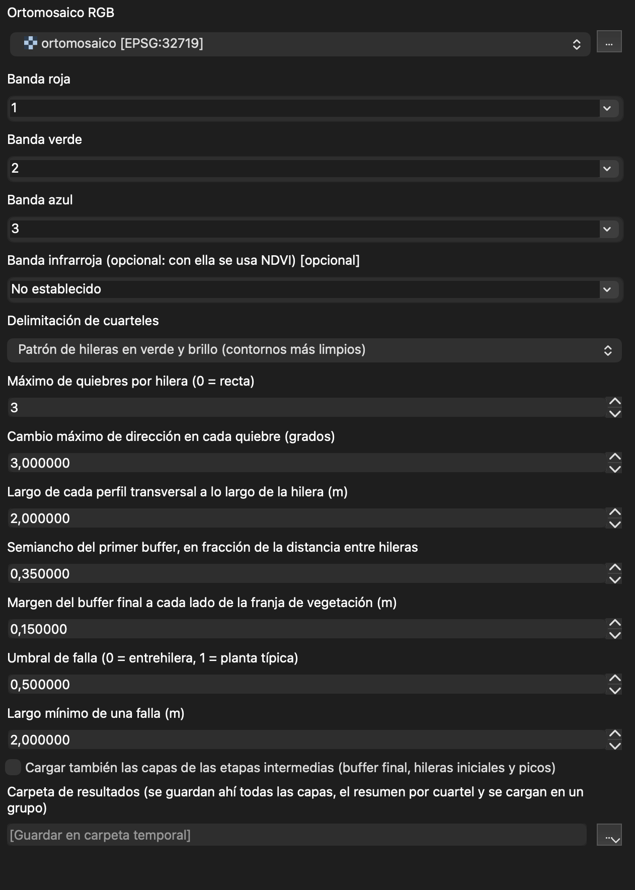
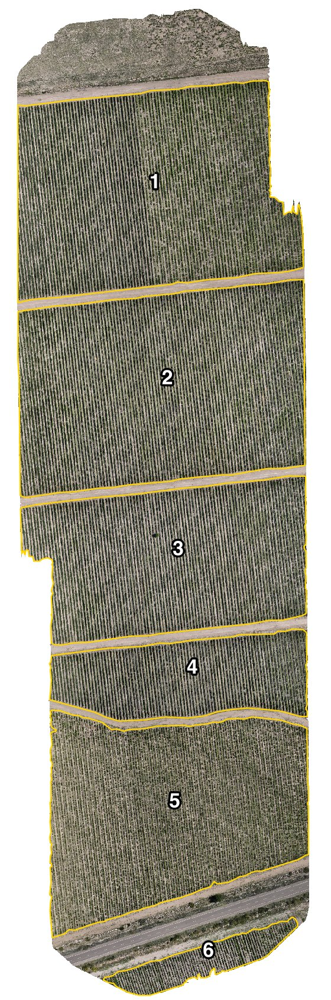
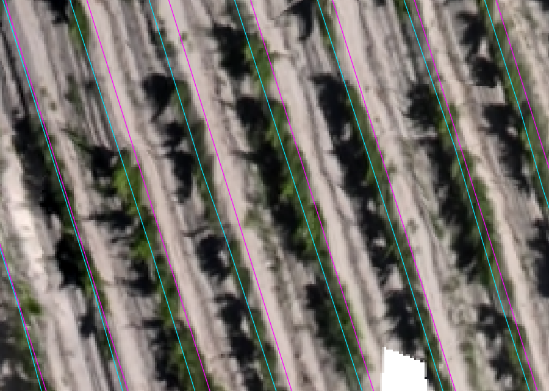
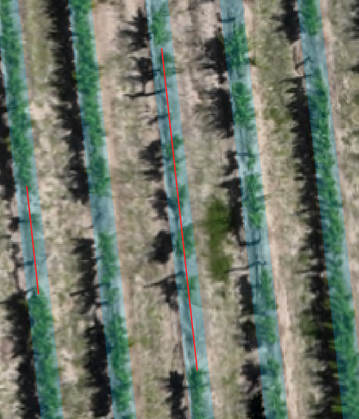
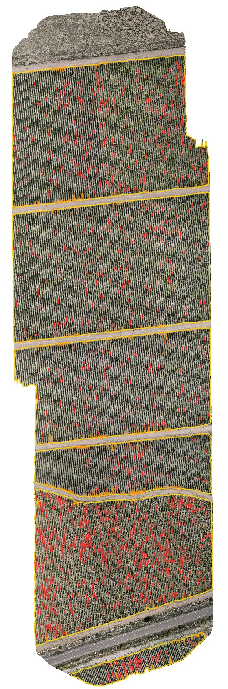

# Detección de Hileras de Cultivo — plugin de QGIS

Plugin de **Processing** que, a partir de un ortomosaico de drone o satélite, delimita los cuarteles, dibuja cada hilera de cultivo y marca las **fallas** (tramos de hilera sin planta). No usa modelos de aprendizaje: trabaja con el verdor de la imagen.

## Cómo funciona

1. **Cuarteles.** Busca en la imagen las zonas con un patrón regular de hileras. El monte o el pasto, aunque sean verdes, no son cuartel; las calles separan un cuartel de otro.
2. **Rumbo y distancia.** En cada cuartel, por separado, mide hacia dónde van las hileras y cada cuánto están.
3. **Hileras.** Traza una recta por hilera y la ajusta a las plantas: mide el verdor en perfiles transversales y corre la línea (con unos pocos quiebres leves) hasta que pase por el centro de la vegetación.
4. **Fallas.** Mide el verdor en una franja angosta alrededor de cada línea ajustada. Donde baja de lo normal en un tramo continuo, marca una falla.

El índice de verdor lo elige solo, por cuartel, entre ExG, VARI, GLI y NGRDI. Si el raster tiene una banda infrarroja, se puede indicar y usa NDVI.

## Instalación

**1. Instalar OpenCV en el Python de QGIS** (con QGIS cerrado). QGIS no lo trae.

| Sistema | Comando |
|---|---|
| Windows (OSGeo4W Shell) | `python -m pip install opencv-python-headless==4.11.0.86` |
| macOS | `/Applications/QGIS.app/Contents/MacOS/bin/python3 -m pip install opencv-python-headless==4.11.0.86` |
| Linux | `python3 -m pip install --user opencv-python-headless==4.11.0.86` |

**2. Copiar el plugin** dentro de la carpeta de plugins de tu perfil de QGIS. La carpeta del plugin es la que contiene `metadata.txt`; el nombre de la carpeta da igual.

- Windows: `%APPDATA%\QGIS\QGIS3\profiles\default\python\plugins\`
- macOS: `~/Library/Application Support/QGIS/QGIS3/profiles/default/python/plugins/`
- Linux: `~/.local/share/QGIS/QGIS3/profiles/default/python/plugins/`

Lo más simple es abrir una terminal en esa carpeta y correr:

```
git clone https://github.com/marcofarena/Crop-RowTrace.git
```

O bien descargar el ZIP desde GitHub (`Code > Download ZIP`), descomprimirlo y copiar la carpeta resultante ahí.

**3. Activarlo.** Reiniciá QGIS y en `Complementos > Administrar e instalar complementos` buscá **Detección de Hileras de Cultivo** y marcalo.

## Uso

1. Abrí el ortomosaico en QGIS. Tiene que tener las bandas R, G y B y estar en un CRS proyectado en metros (UTM, por ejemplo).
2. Abrí la caja de herramientas de Processing (`Ctrl+Alt+T`) y buscá **Hileras y fallas por cuartel (basado en verde)**.
3. Elegí el ráster y una **carpeta de resultados**. Con los valores por defecto alcanza.
4. Ejecutá. Puede tardar un par de minutos, según el tamaño de la imagen.



Los parámetros que más conviene conocer:

| Parámetro | Para qué sirve |
|---|---|
| Delimitación de cuarteles | "Patrón de hileras en verde y brillo" da contornos más limpios; "Solo verde" usa únicamente el verdor. |
| Máximo de quiebres por hilera | Cuántos cambios leves de dirección puede tener cada línea ajustada (0 = recta). |
| Umbral de falla | Qué tan bajo tiene que estar el verdor, respecto de una planta típica, para contar como falla (0,5 por defecto). Más alto marca más fallas. |
| Largo mínimo de una falla | Tramos más cortos que esto no se marcan (2 m por defecto). |
| Banda infrarroja | Opcional: si se indica, se usa NDVI. |

## Qué se obtiene

Al terminar, las capas principales se cargan solas en un grupo, ya con su simbología, y todo queda guardado en la carpeta de resultados.

**Cuarteles.** Un polígono por cuartel, numerados de norte a sur. Cada uno guarda su rumbo, la distancia entre hileras, el índice de verdor usado y el porcentaje de fallas.



**Hileras ajustadas.** Una línea por hilera. En la imagen, la línea magenta es el trazado inicial (recto y paralelo) y la cian es la línea ajustada, que se corre hasta el centro de las plantas.



**Fallas.** Cada falla es un tramo de hilera donde el verdor medido en el buffer (la franja celeste alrededor de la línea) cae por debajo del umbral. Las fallas **de borde** (a menos de 2 m del extremo de la hilera, en naranja) se marcan aparte: dependen de cuánto se pasa el contorno del cuartel de la última planta, y en una cabecera suelen ser suelo desnudo.



Vista general de las fallas (rojo: interiores; naranja: de borde):



**Archivos de la carpeta de resultados:**

| Archivo | Contenido |
|---|---|
| `cuarteles.gpkg` | Polígonos de los cuarteles con sus atributos |
| `hileras_ajustadas.gpkg` | Línea de cada hilera |
| `fallas.gpkg` | Tramos con falla: largo, vigor y si es de borde |
| `buffer_final.gpkg`, `hileras_iniciales.gpkg`, `picos_verde.gpkg` | Capas de las etapas intermedias, para revisar el proceso (se cargan en QGIS con la opción "Cargar también las capas de las etapas intermedias") |
| `resumen_cuarteles.csv` | Una fila por cuartel: área, rumbo, distancia, fallas con y sin borde |

El plugin incluye además los algoritmos **Detectar hileras de cultivo** (el detector original de hileras), **Inferir cuarteles a partir de las hileras** y **Perfil de vegetación y fallas por hilera**.
